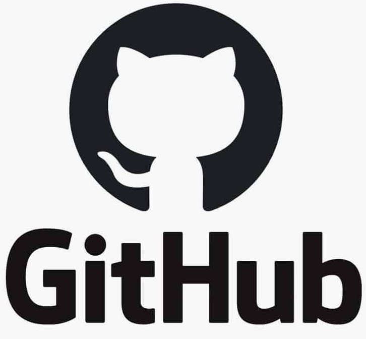
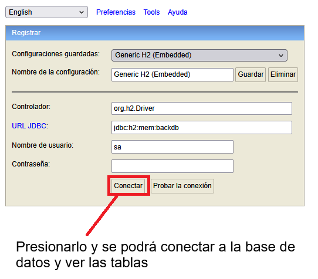
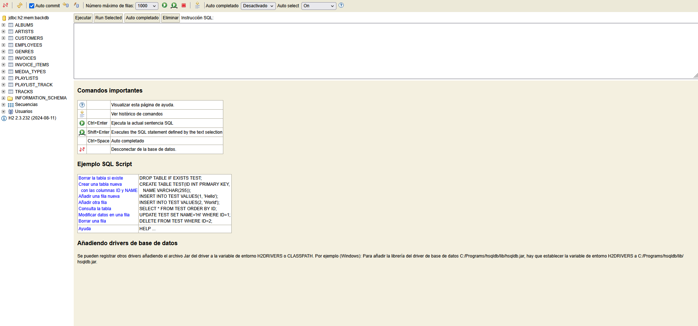

# Parcial Recuperatorio 3K1

 

* __Carrera:__ Ingenieria en Sistemas de Información
* __Materia:__ BackEnd de Aplicaciones
* __Alumno:__ Garzón Sergio Gabriel

## Repositorio de GitHub

~~~GITHUB
  git clone https://github.com/SergioGarzon/parcial-recuperatorio-backend-aplicaciones-2025.git
~~~

## Tecnologias:

* Java (Versión: 20.0.2)

  Para ver la versión de Java, ejecutar el comando:

  ~~~JAVA
  java --version
  ~~~

* Apache Maven (Versión: 3.9.11)

  Para ver la versión de Maven, ejecutar el comando:

  ~~~MAVEN
  mvn --version
  ~~~

* Motor de base de datos embebido H2

## Pasos para la ejecución del proyecto con Maven

* En el sistema operativo (Windows, Linux, Mac OS), ejecutar el comando para abrir el VSCode

  ~~~WINDOWS
  code
  ~~~

* Abrir terminal de VSCode (Ctrl+Shift-ñ)
* Ejecutar comando: 
  
  ~~~MAVEN
  mvn clean compile exec:java
  ~~~

* Nos va salir la url para entrar a la base de datos H2 en el navegador

  ~~~H2
  http://localhost:8082
  ~~~

* Ponemos las credenciales en el navegador

  - __JDBC URL:__ jdbc:h2:mem:backdb
  - __User Name:__ sa
  - __Password:__ (No poner nada)

  Despues de esto presionar el botón conectar

   

  

   

  
  

## Pasos para la ejecución del proyecto con Java

* Generación del archivo .jar con el comando:
  
  ~~~MAVEN
  mvn clean compile package
  ~~~

* Ejecución del .jar es con el comando 
* 
  ~~~JAVA
  java -jar ./target/recuperatorio-parcial-3k1-garzon-sergio-54330
  ~~~